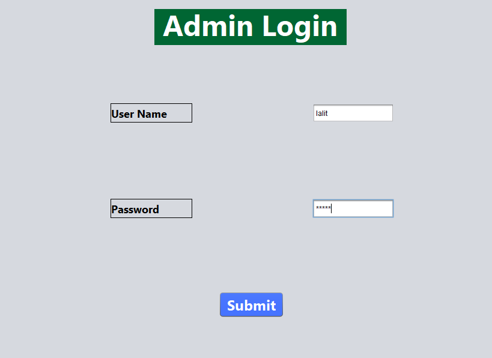
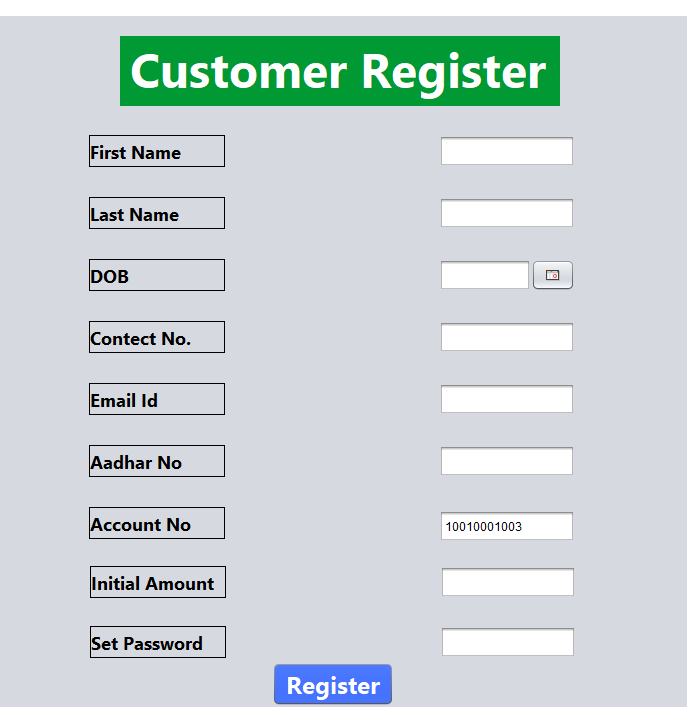
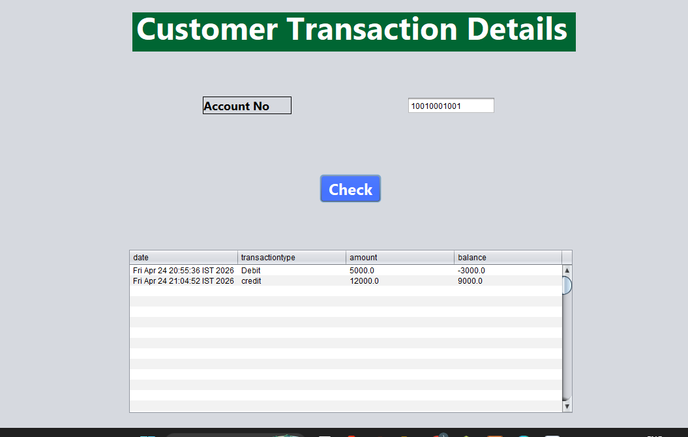
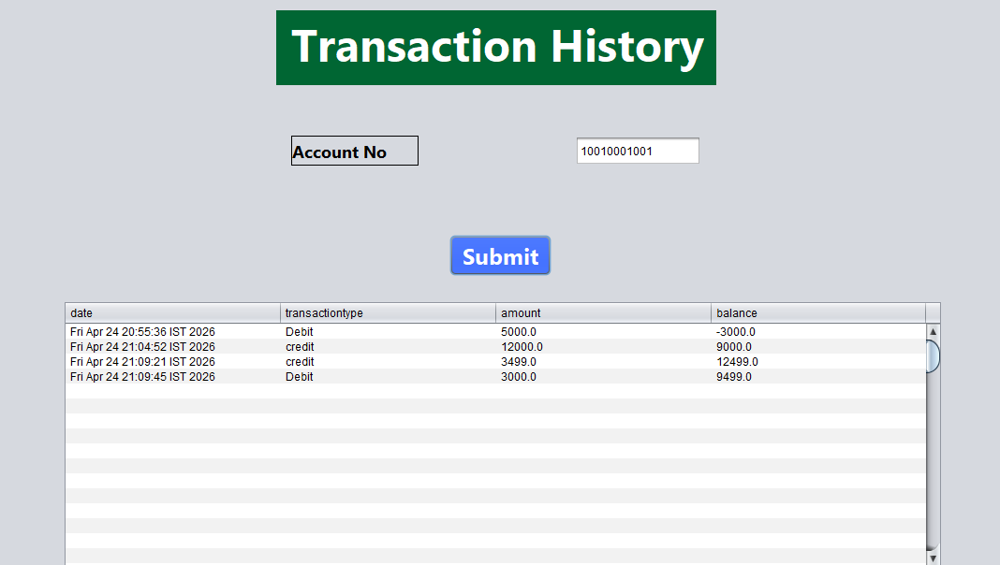

<div align="center">

<h1>💳 Banking Management System</h1>

<p>
  <b>A Java Swing based desktop application for managing customer accounts and banking transactions.</b>
</p>

<p>
  
  
  
  
</p>

<p>
  <i>Secure • Simple • Efficient Banking Experience</i>
</p>

</div>

---

<h2>✨ About The Project</h2>

<p>
Banking Management System is a desktop application built using <b>Java Swing, JDBC and MySQL</b>.
It provides separate access for <b>Admin</b> and <b>Customer</b>, allowing account management,
deposit, withdrawal, balance checking and transaction history tracking.
</p>

---

<h2>🚀 Main Features</h2>

<table>
<tr>
<td>🔐 Admin Login</td>
<td>👤 Customer Login</td>
<td>📝 Customer Registration</td>
</tr>
<tr>
<td>💰 Deposit Money</td>
<td>💸 Withdraw Money</td>
<td>📊 Check Balance</td>
</tr>
<tr>
<td>📜 Transaction History</td>
<td>🧑‍💼 Customer Details</td>
<td>📈 Transaction Details</td>
</tr>
</table>

---

<h2>🖼️ Application Preview</h2>

<table>
<tr>
<td align="center">
  <b>Admin Panel</b><br><br>
  
</td>
<td align="center">
  <b>Customer Registration</b><br><br>
  
</td>
</tr>
<tr>
<td align="center">
  <b>Transaction Dashboard</b><br><br>
  
</td>
<td align="center">
  <b>Transaction History</b><br><br>
  
</td>
</tr>
</table>

---

<h2>🛠️ Tech Stack</h2>

<p>
  
  
  
  
  
</p>

---

<h2>🧭 Project Flow</h2>

```text
Home Page
   |
   |── Admin
   |     ├── Admin Login
   |     ├── Admin Panel
   |     ├── Customer Personal Details
   |     └── Customer Transaction Details
   |
   └── Customer
         ├── Customer Register
         ├── Customer Login
         ├── Transaction Dashboard
         ├── Deposit Money
         ├── Withdrawal Money
         ├── Check Balance
         └── Transaction History
