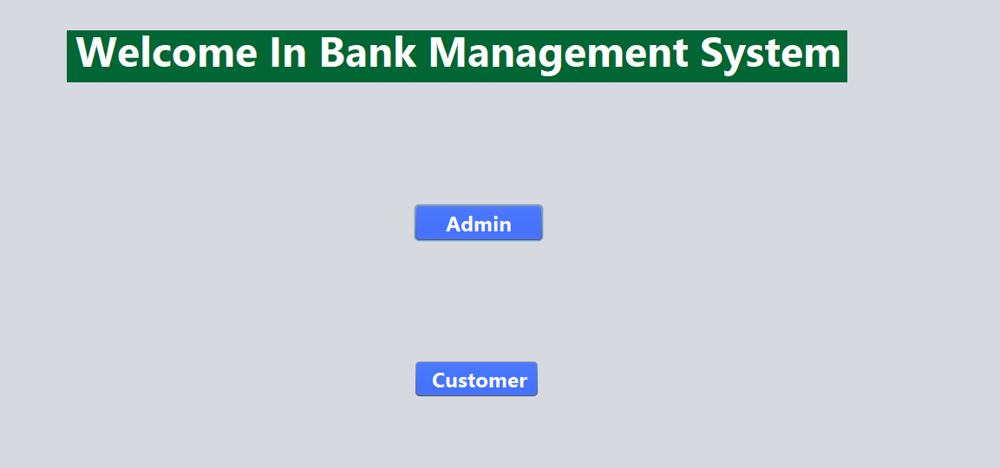

<h1 align="center">💳 Banking Management System</h1>

  <b>Java Desktop Banking Application using Swing, JDBC and MySQL</b>

<h2>📌 Overview</h2>

Banking Management System is a Java desktop application developed using 
<b>Core Java Swing</b>. It provides basic banking operations such as 
customer registration, login, deposit, withdrawal, balance checking and 
transaction history.

<h2>🛠 Technologies Used</h2>

<ul>
  <li>Java</li>
  <li>Java Swing</li>
  <li>JDBC</li>
  <li>MySQL</li>
  <li>NetBeans IDE</li>
</ul>

<h2>✨ Features</h2>

<ul>
  <li>Admin Login</li>
  <li>Admin Panel</li>
  <li>Customer Registration</li>
  <li>Customer Login</li>
  <li>Deposit Money</li>
  <li>Withdrawal Money</li>
  <li>Check Balance</li>
  <li>Transaction History</li>
  <li>Customer Personal Details</li>
  <li>Customer Transaction Details</li>
</ul>

<h2>🧭 Application Flow</h2>

  <b>Home Page → Admin / Customer → Login → Dashboard → Banking Operations</b>

<h2>📸 Project Screenshots</h2>

<h3>🏠 Home Page</h3>

  

<h3>🔐 Admin Login</h3>

  

<h3>🧑‍💼 Admin Panel</h3>

  

<h3>📋 Customer Personal Details</h3>

  

<h3>📊 Customer Transaction Details</h3>

  

<h3>📝 Customer Registration</h3>

  

<h3>🔑 Customer Login</h3>

  

<h3>💼 Transaction Dashboard</h3>

  

<h3>📊 Check Balance</h3>

  

<h3>💰 Deposit Money</h3>

  

<h3>💸 Withdrawal Money</h3>

  

<h3>📜 Transaction History</h3>

  

<h2>⚠️ Important Validation</h2>

<ul>
  <li>Withdrawal is allowed only when the entered amount is less than or equal to the current balance.</li>
  <li>If the entered amount is greater than the current balance, an error message is shown.</li>
  <li>Each deposit and withdrawal is stored in transaction history.</li>
</ul>

<h2>▶️ How to Run</h2>

<ol>
  <li>Clone this repository.</li>
  <li>Open the project in NetBeans IDE.</li>
  <li>Configure MySQL database connection.</li>
  <li>Run the project.</li>
</ol>

<h2>👨‍💻 Author</h2>

  <b>Lalit Kumar</b> 
  GitHub: <a href="https://github.com/Er-Lalit">Er-Lalit</a>

